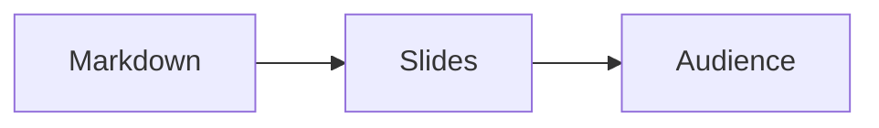

# md-presentations

> A PowerPoint alternative for the LLM era. Markdown in, browser-native slides out.
> Edit the deck **while you're presenting**. Audience sees changes live.

`md-presentations` is a local-first, offline-capable web app that turns Markdown into a polished slide deck. You can paste an outline from Claude/GPT, hit Present, and stop fiddling with PPTX. The killer feature: open the audience window, screen-share *just that window* in Teams/Zoom, and keep editing the source — your audience sees every change in real time.

## Why

PPTX is bloated and tedious. Slide tools that auto-shrink-to-fit your text produce ugly, inconsistent typography. Existing Markdown tools center Vim and ship 3 themes. We wanted:

- **Live editing during presentation.** Edit text, add a slide, fix a typo, and the audience window updates within ~150ms with no flicker on unrelated slides.
- **17 polished themes** out of the box, none of them generic.
- **Layout-based "flexible sizing"** — pick a layout when content gets tight, never silently scale text down to 12px.
- **Beautiful code blocks** via Shiki with VSCode TextMate grammars.
- **Self-contained HTML export** — one file, runs offline, works anywhere.
- **PWA**, no backend, no signup, no telemetry.

## Quick start

```bash
npm install
npm run dev          # → http://localhost:5173
npm run build        # production bundle in dist/
```

## How it works

A single `.md` file is your whole deck:

````md
---
title: My Talk
theme: tokyo-night
aspect: 16:9
pageNumber: true
---

# Welcome

## A subtitle becomes part of the title slide

# Content slide

- Top-level # creates a new slide.
- Standard Markdown — lists, links, tables, code, math, Mermaid.

# Two-column layout

<!-- layout: two-column -->

## Section header

Left column content.

---

Right column content.

# Code, beautifully

```ts {2-3} title="server.ts" mac
import { serve } from 'std/http';
serve((req) => {
  return new Response('Hello, presentation!');
});
```

# Math + diagrams

Inline: $E = mc^2$. Block:

$$\int_0^{\infty} e^{-x^2}\,dx = \frac{\sqrt{\pi}}{2}$$



# Thanks

## Questions?
````

### Slide boundaries
- `#` (H1) starts a new slide.
- `##` (H2) starts a new slide *unless* the previous slide was an H1 with no body — then the H2 is folded in as a subtitle.
- `---` on its own line is also a hard break.

### Per-slide metadata
HTML comments, semicolon-separated:
```
<!-- layout: code-focus; bg: #111; align: center; notes: remember this anecdote -->
```
Supported keys: `layout`, `bg`, `color`, `class`, `notes`, `align`, `image`.

### Layouts (10 in v1)
`title`, `content`, `two-column`, `image-left`, `image-right`, `full-image`, `code-focus`, `quote`, `section-divider`, `end`.

The renderer picks one automatically based on slide content shape (lone H1 → title; one image only → full-image; >50% code → code-focus; etc.). You can always override with `<!-- layout: ... -->`.

## The wedge feature: live edit while presenting

1. Click **Open Audience**. A clean popup window opens with just the current slide.
2. Drag that window onto your second monitor. Share it in Teams/Zoom (Window mode, not full screen).
3. Keep editing the Markdown in the original window. Every change syncs to the audience window within ~150ms over `BroadcastChannel`. No flicker on unrelated slides.
4. Press → in either window to advance. Both stay in sync. Press **B** for blank-black, **W** for blank-white, **F** for fullscreen.

If `BroadcastChannel` isn't available (older browsers, restricted contexts), the app silently falls back to `localStorage` events.

## Themes (17)

**Developer dark/light**: Catppuccin Mocha, Catppuccin Latte, Tokyo Night, Dracula, Gruvbox Dark, Nord, Rosé Pine, One Dark, Solarized Light, Midnight Terminal.

**Design-led**: Editorial Serif, Brutalist Mono, Minimal Sans, Pastel Notebook, Gradient Dawn, Corporate Clean, Academic Paper.

Each theme is a pure CSS variable set (~150 lines). Add your own under `src/themes/` and it shows up in the picker.

You can also add deck-specific overrides via frontmatter:
```yaml
customCss: |
  .slide h1 { letter-spacing: -0.02em; }
  .layout-title .accent-bar { display: none; }
```

## Code blocks

Powered by [Shiki 1.x](https://shiki.style/) with VSCode TextMate grammars. Fence syntax:

````md
```ts {1,3-5} title="server.ts" mac nums
const x = 1;
const y = 2;
const z = 3;
const w = 4;
const v = 5;
```
````

Features: language label, copy button, line highlighting via `{1,3-5}`, optional macOS chrome (`mac`), line numbers (`nums`), native diff support (` ```diff-ts `), 22 languages, 12 themes.

## Keyboard shortcuts

| Key | Action |
|---|---|
| Cmd/Ctrl+P | Toggle Present mode |
| Cmd/Ctrl+Shift+P | Open Audience window |
| Cmd/Ctrl+S | Save (autosaves on every keystroke; this is just the visual confirm) |
| Cmd/Ctrl+E | Export self-contained HTML |
| → / Space / PgDn | Next slide |
| ← / PgUp | Previous slide |
| Home / End | First / last slide |
| 1-9 | Jump to slide N |
| B / `.` | Blank screen (black) |
| W | Blank screen (white) |
| F | Toggle fullscreen |
| Esc | Exit present / fullscreen |

## Export

`Cmd/Ctrl+E` produces a single self-contained HTML file:

- All slides as static HTML.
- Active theme + base CSS inlined.
- Shiki pre-rendered (no runtime).
- KaTeX pre-rendered, CSS inlined.
- Mermaid pre-rendered to inline SVG.
- Images inlined as `data:` URIs.
- ~3KB navigation runtime (arrows, B/W blank, F fullscreen, `?slide=N` deep-link).

Target: <500KB for a typical 20-slide text-and-code deck.

## Storage

Local-first via IndexedDB. Decks autosave on every keystroke. No backend, no accounts, no network calls. Open the same browser later, your decks are there. Drop a `.md` file to import. Drag images into the editor to embed them.

## Architecture

- **Vite + React + TypeScript** SPA.
- **markdown-it** for parsing (faster incremental than `marked`, with token-AST).
- **CodeMirror 6** for the editor.
- **Shiki 1.x** for code blocks.
- **KaTeX** lazy-loaded for math; **Mermaid** lazy-loaded for diagrams.
- **Zustand** for state.
- **idb-keyval** for IndexedDB.
- **BroadcastChannel** for cross-window live sync, with `localStorage` fallback.

The slide canvas is a fixed 1920×1080 (or 1440×1080 / 1080×1080) box scaled with `transform: scale(...)` to fit the viewport — slides look pixel-identical between editor preview, audience window, and exported HTML.

## License

MIT.
