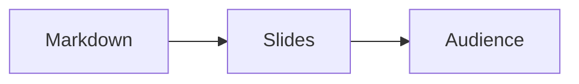

# Slidekick

> Your presentation sidekick. Markdown in, browser-native slides out.
> Edit the deck **while you're presenting**. Audience sees changes live.

`Slidekick` (formerly md-presentations) is a local-first, offline-capable web app that turns Markdown into a polished slide deck. You can paste an outline from Claude/GPT, hit Present, and stop fiddling with PPTX. The killer feature: open the presentation window, screen-share *just that window* in Teams/Zoom, and keep editing the source, your audience sees every change in real time. Live at [slidekick.demant.app](https://slidekick.demant.app).

## Why

PPTX is bloated and tedious. Slide tools that auto-shrink-to-fit your text produce ugly, inconsistent typography. Existing Markdown tools center Vim and ship 3 themes. We wanted:

- **Live editing during presentation.** Edit text, add a slide, fix a typo, and the audience window updates within ~150ms with no flicker on unrelated slides.
- **17 polished themes** out of the box, none of them generic.
- **Layout-based "flexible sizing"** — pick a layout when content gets tight, never silently scale text down to 12px.
- **Beautiful code blocks** via Shiki with VSCode TextMate grammars.
- **Self-contained HTML export** — one file, runs offline, works anywhere.
- **PWA**, no backend, no signup, no telemetry.

## Quick start

```bash
npm install
npm run dev          # → http://localhost:5173
npm run build        # production bundle in dist/
```

## How it works

A single `.md` file is your whole deck:

````md
---
title: My Talk
theme: tokyo-night
aspect: 16:9
pageNumber: true
---

# Welcome

## A subtitle becomes part of the title slide

# Content slide

- Top-level # creates a new slide.
- Standard Markdown — lists, links, tables, code, math, Mermaid.

# Two-column layout

<!-- layout: two-column -->

## Section header

Left column content.

---

Right column content.

# Code, beautifully

```ts {2-3} title="server.ts" mac
import { serve } from 'std/http';
serve((req) => {
  return new Response('Hello, presentation!');
});
```

# Math + diagrams

Inline: $E = mc^2$. Block:

$$\int_0^{\infty} e^{-x^2}\,dx = \frac{\sqrt{\pi}}{2}$$



# Thanks

## Questions?
````

### Slide boundaries
- `#` (H1) starts a new slide.
- `##` (H2) starts a new slide *unless* the previous slide was an H1 with no body — then the H2 is folded in as a subtitle.
- `---` on its own line is also a hard break.

### Per-slide metadata
HTML comments, semicolon-separated:
```
<!-- layout: code-focus; bg: #111; align: center; notes: remember this anecdote -->
```
Supported keys: `layout`, `bg`, `color`, `class`, `notes`, `align`, `image`.

### Layouts (10 in v1)
`title`, `content`, `two-column`, `image-left`, `image-right`, `full-image`, `code-focus`, `quote`, `section-divider`, `end`.

The renderer picks one automatically based on slide content shape (lone H1 → title; one image only → full-image; >50% code → code-focus; etc.). You can always override with `<!-- layout: ... -->`.

## The wedge feature: live edit while presenting

1. Click **Present**. A clean popup window opens with just the current slide.
2. Drag that window onto your second monitor. Share it in Teams/Zoom (Window mode, not full screen).
3. Keep editing the Markdown in the original window. Every change syncs to the audience window within ~150ms over `BroadcastChannel`. No flicker on unrelated slides.
4. Press → in either window to advance. Both stay in sync. Press **B** for blank-black, **W** for blank-white, **F** for fullscreen.

If `BroadcastChannel` isn't available (older browsers, restricted contexts), the app silently falls back to `localStorage` events.

## Themes (17)

**Developer dark/light**: Catppuccin Mocha, Catppuccin Latte, Tokyo Night, Dracula, Gruvbox Dark, Nord, Rosé Pine, One Dark, Solarized Light, Midnight Terminal.

**Design-led**: Editorial Serif, Brutalist Mono, Minimal Sans, Pastel Notebook, Gradient Dawn, Corporate Clean, Academic Paper.

Each theme is a pure CSS variable set (~150 lines). Add your own under `src/themes/` and it shows up in the picker.

### Custom themes (no code)

Open the theme picker and click **Create theme**. A full editor lets you set every theme variable (surfaces, accents, code colors, fonts, type scale, padding) with a live slide preview. Custom themes:

- are saved in IndexedDB and appear in the picker for every deck in this browser,
- can be edited or deleted later (hover a custom theme card and click the pencil),
- **export** to a portable `.mdtheme.json` bundle, and
- **upload** from a `.mdtheme.json` (a raw `.css` variable block is also accepted).

Custom themes flow through everything the built-ins do: the live preview, the audience window, and the self-contained HTML export (their CSS is inlined automatically).

You can also add deck-specific overrides via frontmatter:
```yaml
customCss: |
  .slide h1 { letter-spacing: -0.02em; }
  .layout-title .accent-bar { display: none; }
```

## Code blocks

Powered by [Shiki 1.x](https://shiki.style/) with VSCode TextMate grammars. Fence syntax:

````md
```ts {1,3-5} title="server.ts" mac nums
const x = 1;
const y = 2;
const z = 3;
const w = 4;
const v = 5;
```
````

Features: language label, copy button, line highlighting via `{1,3-5}`, optional macOS chrome (`mac`), line numbers (`nums`), native diff support (` ```diff-ts `), 22 languages, 12 themes.

## Keyboard shortcuts

Presenting happens in a dedicated window: "Present" (or Cmd/Ctrl+P) opens the
presentation popup. Put it on the second monitor or share just that window in
Teams/Zoom; the editor stays your presenter console (notes, timer, thumbnails)
and every edit syncs live.

Editor:

| Key | Action |
|---|---|
| Cmd/Ctrl+P | Open the presentation window |
| Cmd/Ctrl+K | Jump to slide (fuzzy search) |
| Cmd/Ctrl+S | Save now (also autosaves 400ms after every change) |
| Cmd/Ctrl+E | Export self-contained HTML |
| → / Space / PgDn | Next slide (steps through fragments first) |
| ← / PgUp | Previous slide |
| Home / End / 1-9 | First / last / Nth slide |
| O | Overview grid of all slides |

Presentation window (mirrors the editor, and is fully operable on its own):

| Key | Action |
|---|---|
| → / Space / PgDn / L | Next slide (steps through fragments first) |
| ← / PgUp / H | Previous slide |
| Home / End / 1-9 | First / last / Nth slide |
| O | Overview grid (click a slide to jump) |
| D | Draw on the slide (C clears, 1-6 colors, D/Esc exits) |
| B / `.` | Blank screen, black |
| W | Blank screen, white |
| F | Toggle fullscreen |
| Esc | Exit fullscreen |

## Export

`Cmd/Ctrl+E` produces a single self-contained HTML file. It is rendered with the
exact same React layout components and post-processors the live editor uses, so
the export is pixel-identical to the preview, never a separate, drifting code
path:

- All slides as static HTML, with full per-layout structure (title/subtitle,
  two-column splits, quote + attribution, image layouts, code-focus, etc.).
- Active theme + base CSS + infographics CSS inlined.
- Shiki pre-rendered (no runtime), with line highlighting and mac/title chrome.
- KaTeX pre-rendered, CSS inlined only when the deck uses math.
- Mermaid pre-rendered to inline SVG.
- Charts and lucide icons pre-rendered to inline SVG.
- Local (`asset:`) images inlined as `data:` URIs; remote `http(s)` images are
  fetched and inlined best-effort so the file works fully offline.
- Small navigation runtime: arrow / space / PgUp-Dn / Home / End / `1-9`,
  B/W blank, F fullscreen, O overview grid, click and swipe to advance, a theme
  progress bar, working Copy buttons, and a `?slide=N` deep-link.

Any single slide that fails to render falls back to a minimal title card rather
than aborting the whole export.

## Storage

Local-first via IndexedDB. Decks autosave on every keystroke. No backend, no accounts, no network calls. Open the same browser later, your decks are there. Drop a `.md` file to import. Drag images into the editor to embed them.

## Architecture

- **Vite + React + TypeScript** SPA.
- **markdown-it** for parsing (faster incremental than `marked`, with token-AST).
- **CodeMirror 6** for the editor.
- **Shiki 1.x** for code blocks.
- **KaTeX** lazy-loaded for math; **Mermaid** lazy-loaded for diagrams.
- **Zustand** for state.
- **idb-keyval** for IndexedDB.
- **BroadcastChannel** for cross-window live sync, with `localStorage` fallback.

The slide canvas is a fixed 1920×1080 (or 1440×1080 / 1080×1080) box scaled with `transform: scale(...)` to fit the viewport — slides look pixel-identical between editor preview, audience window, and exported HTML.

## License

MIT.
