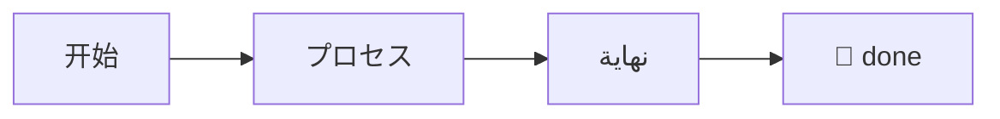
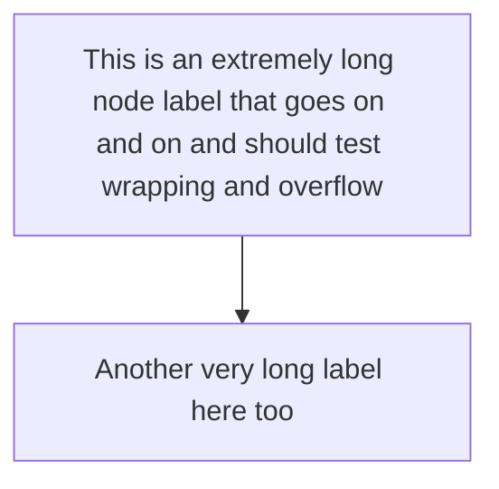

# Zalgo Combining Marks

Combining diacritics that stack far above/below the line:

Z̸̧̢̛̬͓̮̩̙̳͈̗̠̜̬̀͊̈́͛̐̏̽͛̍̕a̵̢̧̛̬͖̙̯̰̳̻̜͖ĺ̶̢̛̤̬͇̮g̷̢̛̬͓̮o̶̡̧̬͖̙ Z̸̧̢̛̬͓̮̩̙̳͈̗̠̜̬̀͊̈́͛̐̏̽͛̍̕a̵̢̧̛̬͖̙̯̰̳̻̜͖ĺ̶̢̛̤̬͇̮g̷̢̛̬͓̮o̶̡̧̬͖̙ Z̸̧̢̛̬͓̮̩̙̳͈̗̠̜̬̀͊̈́͛̐̏̽͛̍̕a̵̢̧̛̬͖̙̯̰̳̻̜͖ĺ̶̢̛̤̬͇̮g̷̢̛̬͓̮o̶̡̧̬͖̙ 

Does it clip or overflow the line box?

# Bidi Override

Left-to-right then an RLO override: ‮gnirts desrever a si sihT‬ back to normal. And a spoof: file‮gpj.exe

# Zero-Width & Control

Zero-width​space‌and‍joiners, word⁠joiner, and soft­hyphens all in one line to see if they wreck spacing.

# Emoji ZWJ & Modifiers

Family: 👨‍👩‍👧‍👦 · Skin tones: 👍🏻👍🏽👍🏿 · Flags: 🇺🇳🇯🇵🏴󠁧󠁢󠁳󠁣󠁴󠁿 · Keycaps: 1️⃣2️⃣3️⃣ · Profession: 🧑‍💻👩‍🚀

# Full-Width & Vertical

Ｆｕｌｌｗｉｄｔｈ　ＡＳＣＩＩ．　ﾊﾝｶｸ katakana. 縦書きテスト。​

# RTL Mixed Numbers

Arabic with numbers: قيمة 12345 و 67890 مع نص إنجليزي English inline ثم عربي مرة أخرى.

# Long Unbreakable

xxxxxxxxxxxxxxxxxxxxxxxxxxxxxxxxxxxxxxxxxxxxxxxxxxxxxxxxxxxxxxxxxxxxxxxxxxxxxxxxxxxxxxxxxxxxxxxxxxxxxxxxxxxxxxxxxxxxxxxxxxxxxxxxxxxxxxxxxxxxxxxxxxxxxxxxxxxxxxxxxxxxxxxxxxxxxxxxxxxxxxxxxxxxxxxxxxxxxxxxxxxxxxxxxxxxxxxxxxxxxxxxxxxxxxxxxxxxxxxxxxxxxxxxxxxxxxxxxxxxxxxxxxxxxxxxxxxxxxxxxxxxxxxxxxxxxxxxxxxxxxxxxxxxxxxxxxxxxxxxxxxxxxxxxxxxxxxxxxxxxxxxxxxxxxxxxxxxxxxxxxxxxxxxxxxxxxxxxxxxxxxxxxxxxxxxxxxxxxxxxxxxxxxxxxxxxxxxxxxxxxxxxxxxxxxxxxxxxxxxxxxxxxxxxxxxxxxxxxxxxxxxxxxxxxxxxxxxxxxxxxxxxxxxxxxxxxxxxxxxxxxxxxxxxxxxxxxxxxxxxxxxxxxxxxxxxxxxxxxxxxxxxxxxxxxxxxxxxxxxxxxxxxxxxxxxxxxxxxxxxxxxxxxxxxxxxxxxxxxxxxxxxxxxxxxxxxxxxxxxxxxxxxxxxxxxxxxxxxxxxxxxxxxxxxxxxxxxxxxxxxxxxxxxxxxxxxxxxxxxxxxxxxxxxxxxxxxxxxxxxxxxxxxxxxxxxxxxxxxxxxxxxxxxxxxxxxxxxxxxxxxxxxxxxxxxxxxxxxxxxxxxxxxxxxxxxxxxxxxxxxxxxxxxxxxxxxxxxxxxxxxxxxxxxxxxxxxxxxxxxxxxxxxxxxxxxxxxxxxxxxxxxxxxxxxxxxxxxxxxxxxxxxxxxxxxxxxxxxxxxxxxxxxxxxxxxxxxxxxxxxxxxxxxxxxxxxxxxxxxxxxxxxxxxxxxxxxxxxxxxxxxxxxxxxxxxxxxxxxxxxxxxxxxxxxxxxxxxxxxxxxxxxxxxxxxxxxxxxxxxxxxxxxxxxxxxxxxxxxxxxxxxxxxxxxxxxxxxxxxxxxxxxxxxxxxxxxxxxxxxxxxxxxxxxxxxxxxxxxxxxxxxxxxxxxxxxxxxxxxxxxxxxxxxxxxxxxxxxxxxxxxxxxxxxxxxxxxxxxxxxxxxxxxxxxxxxxxxxxxxxxxxxxxxxxxxxxxxxxxxxxxxxxxxxxxxxxxxxxxxxxxxxxxxxxxxxxxxxxxxxxxxxxxxxxxxxxxxxxxxxxxxxxxxxxxxxxxxxxxxxxxxxxxxxxxxxxxxxxxxxxxxxxxxxxxxxxxxxxxxxxxxxxxxxxxxxxxxxxxxxxxxxxxxxxxxxxxxxxxxxxxxxxxxxxxxxxxxxxxxxxxxxxxxxxxxxxxxxxxxxxxxxxxxxxxxxxxxxxxxxxxxxxxxxxxxxxxxxxxxxxxxxxxxxxxxxxxxxxxxxxxxxxxxxxxxxxxxxxxxxxxxxxxxxxxxxxxxxxxxxxxxxxxxxxxxxxxxxxxxxxxxxxxxxxxxxxxxxxxxxxxxxxxxxxxxxxxxxxxxxxxxxxxxxxxxxxxxxxxxxxxxxxxxxxxxxxxxxxxxxxxxxxxxxxxxxxxxxxxxxxxxxxxxxxxxxxxxxxxxxxxxxxxxxxxxxxxxxxxxxxxxxxxxxxxxxxxxxxxxxxxxxxxxxxxxxxxxxxxxxxxxxxxxxxxxxxxxxxxxxxxxxxxxxxxxxxxxxxxxxxxxxxxxxxxxxxxxxxxxxxxxxxxxxxxxxxxxxxxxxxxxxxxxxxxxxxxxxxxxxxxxxxxxxxxxxxxxxxxxxxxxxxxxxxxxxxxxxxxxxxxxxxxxxxxxxxxxxxxxxxxxxxxxxxxxxxxxxxxxxxxxxxxxxxxxxxxxxxxxxxxxxxxxxxxxxxxxxxxxxxxxxxxxxxxxxxxxxxxxxxxxxxxxxxxxxxxxxxxxxxxxxxxxxxxxxxxxxxxxxxxxxxxxxxxxxxxxxxxxxxxxxxxxxxxxxxxxxxx

# Long Emoji Run

🎉🎉🎉🎉🎉🎉🎉🎉🎉🎉🎉🎉🎉🎉🎉🎉🎉🎉🎉🎉🎉🎉🎉🎉🎉🎉🎉🎉🎉🎉🎉🎉🎉🎉🎉🎉🎉🎉🎉🎉🎉🎉🎉🎉🎉🎉🎉🎉🎉🎉🎉🎉🎉🎉🎉🎉🎉🎉🎉🎉🎉🎉🎉🎉🎉🎉🎉🎉🎉🎉🎉🎉🎉🎉🎉🎉🎉🎉🎉🎉🎉🎉🎉🎉🎉🎉🎉🎉🎉🎉🎉🎉🎉🎉🎉🎉🎉🎉🎉🎉🎉🎉🎉🎉🎉🎉🎉🎉🎉🎉🎉🎉🎉🎉🎉🎉🎉🎉🎉🎉🎉🎉🎉🎉🎉🎉🎉🎉🎉🎉🎉🎉🎉🎉🎉🎉🎉🎉🎉🎉🎉🎉🎉🎉🎉🎉🎉🎉🎉🎉🎉🎉🎉🎉🎉🎉🎉🎉🎉🎉🎉🎉🎉🎉🎉🎉🎉🎉🎉🎉🎉🎉🎉🎉🎉🎉🎉🎉🎉🎉🎉🎉🎉🎉🎉🎉🎉🎉🎉🎉🎉🎉🎉🎉🎉🎉🎉🎉🎉🎉🎉🎉🎉🎉🎉🎉🎉🎉🎉🎉🎉🎉🎉🎉🎉🎉🎉🎉🎉🎉🎉🎉🎉🎉🎉🎉🎉🎉🎉🎉🎉🎉🎉🎉🎉🎉🎉🎉🎉🎉🎉🎉🎉🎉🎉🎉🎉🎉🎉🎉🎉🎉🎉🎉🎉🎉🎉🎉🎉🎉🎉🎉🎉🎉🎉🎉🎉🎉🎉🎉🎉🎉🎉🎉🎉🎉🎉🎉🎉🎉🎉🎉🎉🎉🎉🎉🎉🎉🎉🎉🎉🎉🎉🎉🎉🎉🎉🎉🎉🎉🎉🎉🎉🎉🎉🎉🎉🎉🎉🎉🎉🎉🎉🎉🎉🎉🎉🎉🎉🎉🎉🎉🎉🎉🎉🎉🎉🎉🎉🎉🎉🎉🎉🎉🎉🎉🎉🎉🎉🎉🎉🎉🎉🎉🎉🎉🎉🎉🎉🎉🎉🎉🎉🎉🎉🎉🎉🎉🎉🎉🎉🎉🎉🎉🎉🎉🎉🎉🎉🎉🎉🎉🎉🎉🎉🎉🎉🎉🎉🎉🎉🎉🎉🎉🎉🎉🎉🎉🎉🎉🎉🎉🎉🎉🎉🎉🎉🎉🎉🎉

# Combining Explosion

á̂̃̄̅á̂̃̄̅á̂̃̄̅á̂̃̄̅á̂̃̄̅á̂̃̄̅á̂̃̄̅á̂̃̄̅á̂̃̄̅á̂̃̄̅á̂̃̄̅á̂̃̄̅á̂̃̄̅á̂̃̄̅á̂̃̄̅á̂̃̄̅á̂̃̄̅á̂̃̄̅á̂̃̄̅á̂̃̄̅á̂̃̄̅á̂̃̄̅á̂̃̄̅á̂̃̄̅á̂̃̄̅á̂̃̄̅á̂̃̄̅á̂̃̄̅á̂̃̄̅á̂̃̄̅á̂̃̄̅á̂̃̄̅á̂̃̄̅á̂̃̄̅á̂̃̄̅á̂̃̄̅á̂̃̄̅á̂̃̄̅á̂̃̄̅á̂̃̄̅á̂̃̄̅á̂̃̄̅á̂̃̄̅á̂̃̄̅á̂̃̄̅á̂̃̄̅á̂̃̄̅á̂̃̄̅á̂̃̄̅á̂̃̄̅á̂̃̄̅á̂̃̄̅á̂̃̄̅á̂̃̄̅á̂̃̄̅á̂̃̄̅á̂̃̄̅á̂̃̄̅á̂̃̄̅á̂̃̄̅á̂̃̄̅á̂̃̄̅á̂̃̄̅á̂̃̄̅á̂̃̄̅á̂̃̄̅á̂̃̄̅á̂̃̄̅á̂̃̄̅á̂̃̄̅á̂̃̄̅á̂̃̄̅á̂̃̄̅á̂̃̄̅á̂̃̄̅á̂̃̄̅á̂̃̄̅á̂̃̄̅á̂̃̄̅á̂̃̄̅á̂̃̄̅á̂̃̄̅á̂̃̄̅á̂̃̄̅á̂̃̄̅á̂̃̄̅á̂̃̄̅á̂̃̄̅á̂̃̄̅á̂̃̄̅á̂̃̄̅á̂̃̄̅á̂̃̄̅á̂̃̄̅á̂̃̄̅á̂̃̄̅á̂̃̄̅á̂̃̄̅á̂̃̄̅á̂̃̄̅á̂̃̄̅á̂̃̄̅á̂̃̄̅á̂̃̄̅á̂̃̄̅á̂̃̄̅á̂̃̄̅á̂̃̄̅á̂̃̄̅á̂̃̄̅á̂̃̄̅á̂̃̄̅á̂̃̄̅á̂̃̄̅á̂̃̄̅á̂̃̄̅á̂̃̄̅á̂̃̄̅á̂̃̄̅á̂̃̄̅á̂̃̄̅á̂̃̄̅á̂̃̄̅á̂̃̄̅á̂̃̄̅á̂̃̄̅á̂̃̄̅á̂̃̄̅á̂̃̄̅á̂̃̄̅á̂̃̄̅á̂̃̄̅á̂̃̄̅á̂̃̄̅á̂̃̄̅á̂̃̄̅á̂̃̄̅á̂̃̄̅á̂̃̄̅á̂̃̄̅á̂̃̄̅á̂̃̄̅á̂̃̄̅á̂̃̄̅á̂̃̄̅á̂̃̄̅á̂̃̄̅á̂̃̄̅á̂̃̄̅á̂̃̄̅á̂̃̄̅á̂̃̄̅á̂̃̄̅á̂̃̄̅á̂̃̄̅á̂̃̄̅á̂̃̄̅á̂̃̄̅á̂̃̄̅á̂̃̄̅á̂̃̄̅á̂̃̄̅á̂̃̄̅á̂̃̄̅á̂̃̄̅á̂̃̄̅á̂̃̄̅á̂̃̄̅á̂̃̄̅á̂̃̄̅á̂̃̄̅á̂̃̄̅á̂̃̄̅á̂̃̄̅á̂̃̄̅á̂̃̄̅á̂̃̄̅á̂̃̄̅á̂̃̄̅á̂̃̄̅á̂̃̄̅á̂̃̄̅á̂̃̄̅á̂̃̄̅á̂̃̄̅á̂̃̄̅á̂̃̄̅á̂̃̄̅á̂̃̄̅á̂̃̄̅á̂̃̄̅á̂̃̄̅á̂̃̄̅á̂̃̄̅á̂̃̄̅á̂̃̄̅á̂̃̄̅á̂̃̄̅á̂̃̄̅á̂̃̄̅á̂̃̄̅á̂̃̄̅á̂̃̄̅á̂̃̄̅á̂̃̄̅á̂̃̄̅á̂̃̄̅á̂̃̄̅á̂̃̄̅á̂̃̄̅á̂̃̄̅á̂̃̄̅á̂̃̄̅á̂̃̄̅á̂̃̄̅á̂̃̄̅á̂̃̄̅á̂̃̄̅á̂̃̄̅á̂̃̄̅á̂̃̄̅á̂̃̄̅á̂̃̄̅á̂̃̄̅á̂̃̄̅á̂̃̄̅á̂̃̄̅á̂̃̄̅á̂̃̄̅á̂̃̄̅á̂̃̄̅á̂̃̄̅á̂̃̄̅á̂̃̄̅á̂̃̄̅á̂̃̄̅á̂̃̄̅á̂̃̄̅á̂̃̄̅á̂̃̄̅á̂̃̄̅á̂̃̄̅á̂̃̄̅á̂̃̄̅á̂̃̄̅á̂̃̄̅á̂̃̄̅á̂̃̄̅á̂̃̄̅á̂̃̄̅á̂̃̄̅á̂̃̄̅á̂̃̄̅á̂̃̄̅á̂̃̄̅á̂̃̄̅á̂̃̄̅á̂̃̄̅á̂̃̄̅á̂̃̄̅á̂̃̄̅á̂̃̄̅á̂̃̄̅á̂̃̄̅á̂̃̄̅á̂̃̄̅á̂̃̄̅á̂̃̄̅á̂̃̄̅á̂̃̄̅á̂̃̄̅á̂̃̄̅á̂̃̄̅á̂̃̄̅á̂̃̄̅á̂̃̄̅á̂̃̄̅á̂̃̄̅á̂̃̄̅á̂̃̄̅á̂̃̄̅á̂̃̄̅á̂̃̄̅á̂̃̄̅á̂̃̄̅á̂̃̄̅á̂̃̄̅á̂̃̄̅á̂̃̄̅á̂̃̄̅á̂̃̄̅á̂̃̄̅á̂̃̄̅á̂̃̄̅á̂̃̄̅á̂̃̄̅á̂̃̄̅á̂̃̄̅á̂̃̄̅á̂̃̄̅

# NBSP And Spaces

a    b  c  d normal e   f (regular collapsed).

# Escape Soup

Literal backslash \\ then \*not italic\* and \_not emphasis\_ and \# not heading and \[not link\] and \`not code\` and \~\~not strike\~\~.

# Nested Emphasis

***bold italic*** and **bold *nested italic* back** and *italic **nested bold** back* and ***a**b*c and _under **mixed** score_.

# Intraword Underscores

snake_case_variable_name and my_long_python_function_name_here and a__b__c and file_v1_final_FINAL.txt

# Special Char Soup

Every special: \ / | < > & " ' ` ~ ! @ # $ % ^ & * ( ) _ + = { } [ ] : ; , . ? and <not-a-tag> &notanentity; &amp; &#x1F600;

# Asterisk Storm

*a* **b** ***c*** * d * ** e ** *** f *** *** *** * * * ***

# Pipe Characters

Inline pipes a|b|c and \| escaped and code `a|b` outside a table.

#

A slide whose H1 is empty (just a hash).

# H1

## H2

### H3

#### H4

##### H5

###### H6

All six heading levels on one slide.

# Trailing Hashes ###

ATX heading with closing hashes.

Setext H1
=========

Setext H2
---------

Underlined headings (may or may not be supported).

#NoSpace

#alsonospace — these are NOT headings without a space; should render as text.

# Empty List Items

- 
- item
- 
- another
-

# Deep Nest 10

- level 1
  - level 2
    - level 3
      - level 4
        - level 5
          - level 6
            - level 7
              - level 8
                - level 9
                  - level 10

# Ordered Huge Start

997. nine ninety seven
998. nine ninety eight
999. nine ninety nine

# Loose vs Tight

- tight one
- tight two

- loose one

- loose two

# Mixed Markers

- dash
* star
+ plus
1. one
2) two-paren

# Deep Blockquote

> level 1
>> level 2
>>> level 3
>>>> level 4
>>>>> level 5
>>>>>> level 6
>>>>>>> level 7
>>>>>>>> level 8

# Blockquote Kitchen Sink

> A quote with a list:
> - one
> - two
>
> ```js
> const inQuote = true;
> ```
>
> | a | b |
> |---|---|
> | 1 | 2 |

# Ragged Table

| a | b | c |
|---|---|---|
| 1 |
| 1 | 2 | 3 | 4 | 5 |
| only one |

# Table No Body

| head1 | head2 |
|-------|-------|

# Table Missing Separator

| a | b |
| 1 | 2 |

Without a header separator row this is not a table.

# Table Pipes & Code

| expr | note |
|------|------|
| `a\|\|b` | logical or |
| \| | literal pipe |
| a\|b | escaped |

# Table Empty Cells

| x | y | z |
|---|---|---|
|   |   |   |
| a |   | c |

# Table 40 Columns

c0 | c1 | c2 | c3 | c4 | c5 | c6 | c7 | c8 | c9 | c10 | c11 | c12 | c13 | c14 | c15 | c16 | c17 | c18 | c19 | c20 | c21 | c22 | c23 | c24 | c25 | c26 | c27 | c28 | c29 | c30 | c31 | c32 | c33 | c34 | c35 | c36 | c37 | c38 | c39
---|---|---|---|---|---|---|---|---|---|---|---|---|---|---|---|---|---|---|---|---|---|---|---|---|---|---|---|---|---|---|---|---|---|---|---|---|---|---|---
0 | 1 | 2 | 3 | 4 | 5 | 6 | 7 | 8 | 9 | 10 | 11 | 12 | 13 | 14 | 15 | 16 | 17 | 18 | 19 | 20 | 21 | 22 | 23 | 24 | 25 | 26 | 27 | 28 | 29 | 30 | 31 | 32 | 33 | 34 | 35 | 36 | 37 | 38 | 39

# Empty Code Block

```
```

# Code Backticks Inside

````md
```js
nested fence
```
````

# Tilde Fence

~~~python
print("tilde fence")
~~~

# Fence Weird Lang

```this-is-not-a-real-language-name-12345
some content
```

# Code Only Whitespace

```
    
	
   
```

# Code With Long Line

```js
const x = "yyyyyyyyyyyyyyyyyyyyyyyyyyyyyyyyyyyyyyyyyyyyyyyyyyyyyyyyyyyyyyyyyyyyyyyyyyyyyyyyyyyyyyyyyyyyyyyyyyyyyyyyyyyyyyyyyyyyyyyyyyyyyyyyyyyyyyyyyyyyyyyyyyyyyyyyyyyyyyyyyyyyyyyyyyyyyyyyyyyyyyyyyyyyyyyyyyyyyyyyyyyyyyyyyyyyyyyyyyyyyyyyyyyyyyyyyyyyyyyyyyyyyyyyyyyyyyyyyyyyyyyyyyyyyyyyyyyyyyyyyyyyyyyyyyyyyyyyyyyyyyyyyyyyyyyyyyyyyyyyyyyyyyyyyyyyyyyyyyyyyyyyyyyyyyyyyyyyyyyyyyyyyyyyyyyyyyyyyyyyyyyyyyyyyyyyyyyyyyyyyyyyyyyyyyyyyyyyyyyyyyyyyyyyyyyyyyyyyyyyyyyyyyyyyyyyyyyyyyyyyyyyyyyyyyyyyyyyyyyyyyyyyyyyyyyyyyyyyyyyyyyyyyyyyyyyyyyyyyyyyyyyyyyyyyyyyyyyyyyyyyyyyyyyyyyyyyyyyyyyyyyyyyyyyyyyyyyyyyyyyyyyyyyyyyyyyyyyyyyyyyyyyyyyyyyyyyyyyyyyyyyyyyyyyyyyyyyyyyyyyyyyyyyyyyyyyyyyyyyyyyyyyyyyyyyyyyyyyyyyyyyyyyyyyyyyyyyyyyyyyyyyyyyyyyyyyyyyyyyyyyyyyyyyyyyyyyyyyyyyyyyyyyyyyyyyyyyyyyyyyyyyyyyyyyyyyyyyyyyyyyyyyyyyyyyyyyyyyyyyyyyyyyyyyyyyyyyyyyyyyyyyyyyyyyyyyyyyyyyyyyyyyyyyyyyyyyyyyyyyyyyyyyyyyyyyyyyyyyyyyyyyyyyyyyyyyyyyyyyyyyyyyyyyyyyyyyyyyyyyyyyyyyyyyyyyyyyyyyyyyyyyyyyyyyyyyyyyyyyyyyyyyyyyyyyyyyyyyyyyyyyyyyyyyyyyyyyyyyyy";
```

# Code HTML & Special

```html
<script>alert(1)</script>
<div class="x">&amp; &lt; &gt;</div>
```

# Raw HTML Block

<div style="padding:2rem;border:2px solid red">Raw HTML div with inline style.</div>

<table><tr><td>raw</td><td>table</td></tr></table>

# XSS Script Tag

Before.

<script>window.__xss_script=1;document.title='pwned'</script>

After — the script must not run.

# XSS Img Onerror


The onerror handler must not fire arbitrary code.

# XSS SVG Onload

<svg onload="window.__xss_svg=1"><rect width="10" height="10"/></svg>

SVG onload must not run.

# XSS Javascript Link

[click me](javascript:window.__xss_link=1) and <a href="javascript:window.__xss_a=1">raw anchor</a>.

# XSS Iframe

<iframe src="javascript:window.__xss_iframe=1" width="200" height="100"></iframe>

Iframe injection.

# HTML Style Injection

<style>.slide-canvas{display:none!important}</style>

A style tag trying to hide the whole slide must not nuke rendering.

# Currency Not Math

The plan costs $5 today and $10 tomorrow, a $5 to $10 range, so $$ is money not math here.

# Empty Math

Inline empty $$ and block:

$$
$$

Should degrade, not crash.

# Unclosed Inline Math

Here is an unclosed $x = y + z and then normal text continues on the line.

# Dangerous TeX Macro

$$\def\x{\x}\x$$

$$\includegraphics{/etc/passwd}$$

KaTeX must reject unsafe macros gracefully.

# Math Special Chars

$\text{100\% \& <tag> \#hash}$ and $a \backslash b$ and $\{ \}$.

# Huge Math Expression

$$x_{0} + x_{1} + x_{2} + x_{3} + x_{4} + x_{5} + x_{6} + x_{7} + x_{8} + x_{9} + x_{10} + x_{11} + x_{12} + x_{13} + x_{14} + x_{15} + x_{16} + x_{17} + x_{18} + x_{19} + x_{20} + x_{21} + x_{22} + x_{23} + x_{24} + x_{25} + x_{26} + x_{27} + x_{28} + x_{29} + x_{30} + x_{31} + x_{32} + x_{33} + x_{34} + x_{35} + x_{36} + x_{37} + x_{38} + x_{39} = \sum_{i=0}^{40} x_i$$

# Mermaid Empty

```mermaid
```

# Mermaid Only Comment

```mermaid
%% just a comment
```

# Mermaid Unicode Labels



# Mermaid Very Wide


# Mermaid Long Labels



# Chart Empty Data

```chart
type: bar
data:
```

# Chart All Zero

```chart
type: bar
data:
  A: 0
  B: 0
  C: 0
```

# Chart Negatives

```chart
type: bar
title: Net
data:
  Gain: 50
  Loss: -30
  Net: 20
  Deep: -60
```

# Chart Non-Numeric

```chart
type: bar
data:
  A: hello
  B: world
```

# Chart Tiny Diffs

```chart
type: bar
data:
  A: 1000000
  B: 1000001
  C: 1000002
```

# Chart Single Point Line

```chart
type: line
labels: [only]
series:
  S: [42]
```

# Chart Duplicate Keys

```chart
type: pie
data:
  A: 10
  A: 20
  A: 30
```

# Image No Alt


# Image Empty Src


An image with an essentially empty source.

# Image With Title


# Many Tiny Images

                                                           

# Image Broken + Text


Body text beside a broken image.

# Empty & Weird Links

[empty]() and [space]( ) and [nested [brackets]](https://example.com) and [](https://notext.com).

# Reference Links

A [reference][ref] link and another [ref] and [num][1].

[ref]: https://example.com
[1]: https://example.org

# Autolinks

<https://example.com> and <mailto:a@b.com> and bare https://linkify.me/auto and www.example.com.

# Link Special Chars

[weird](https://example.com/path?a=1&b=2#frag) and [paren](https://en.wikipedia.org/wiki/Example_(disambiguation)).

# Callout Unknown Type

:::wat
Unknown container type.
:::

# Callout Empty

:::tip
:::

# Callout Nested

:::info
Outer

:::warning
Inner nested container
:::

Back to outer
:::

# Callout Unclosed

:::danger
This callout is never closed on this slide

# Icon Unknown

:icon[definitely-not-an-icon-xyz]: fallback and :icon[]: empty and :icon[zap]: real.

# Many Fragments

- + fragment 1
- + fragment 2
- + fragment 3
- + fragment 4
- + fragment 5
- + fragment 6
- + fragment 7
- + fragment 8
- + fragment 9
- + fragment 10
- + fragment 11
- + fragment 12
- + fragment 13
- + fragment 14

# Bad Meta Values

<!-- layout: not-a-real-layout; bg: notacolor; color: alsobad; align: sideways -->

Invalid metadata should be ignored, not crash.

# Comment Only Body

<!-- just a comment and nothing else -->

# Weird Meta Combo

<!-- bg: linear-gradient(45deg, #f00, #00f); color: #fff -->

Gradient background via meta.

# Only Invisible

​​​

# HR Variants

Above.

---

***

___

- - -

Below (various thematic breaks).

# Tabs And Indent

	Tab-indented line.
    Four-space line.
	  Mixed tab+space.

Normal.

# Trailing Whitespace

Line with trailing spaces.     
Next line.      
Hard break?

# Many Inline Elements

[l0](https://e.com/0) [l1](https://e.com/1) [l2](https://e.com/2) [l3](https://e.com/3) [l4](https://e.com/4) [l5](https://e.com/5) [l6](https://e.com/6) [l7](https://e.com/7) [l8](https://e.com/8) [l9](https://e.com/9) [l10](https://e.com/10) [l11](https://e.com/11) [l12](https://e.com/12) [l13](https://e.com/13) [l14](https://e.com/14) [l15](https://e.com/15) [l16](https://e.com/16) [l17](https://e.com/17) [l18](https://e.com/18) [l19](https://e.com/19) [l20](https://e.com/20) [l21](https://e.com/21) [l22](https://e.com/22) [l23](https://e.com/23) [l24](https://e.com/24) [l25](https://e.com/25) [l26](https://e.com/26) [l27](https://e.com/27) [l28](https://e.com/28) [l29](https://e.com/29) [l30](https://e.com/30) [l31](https://e.com/31) [l32](https://e.com/32) [l33](https://e.com/33) [l34](https://e.com/34) [l35](https://e.com/35) [l36](https://e.com/36) [l37](https://e.com/37) [l38](https://e.com/38) [l39](https://e.com/39) [l40](https://e.com/40) [l41](https://e.com/41) [l42](https://e.com/42) [l43](https://e.com/43) [l44](https://e.com/44) [l45](https://e.com/45) [l46](https://e.com/46) [l47](https://e.com/47) [l48](https://e.com/48) [l49](https://e.com/49) [l50](https://e.com/50) [l51](https://e.com/51) [l52](https://e.com/52) [l53](https://e.com/53) [l54](https://e.com/54) [l55](https://e.com/55) [l56](https://e.com/56) [l57](https://e.com/57) [l58](https://e.com/58) [l59](https://e.com/59) [l60](https://e.com/60) [l61](https://e.com/61) [l62](https://e.com/62) [l63](https://e.com/63) [l64](https://e.com/64) [l65](https://e.com/65) [l66](https://e.com/66) [l67](https://e.com/67) [l68](https://e.com/68) [l69](https://e.com/69) [l70](https://e.com/70) [l71](https://e.com/71) [l72](https://e.com/72) [l73](https://e.com/73) [l74](https://e.com/74) [l75](https://e.com/75) [l76](https://e.com/76) [l77](https://e.com/77) [l78](https://e.com/78) [l79](https://e.com/79) [l80](https://e.com/80) [l81](https://e.com/81) [l82](https://e.com/82) [l83](https://e.com/83) [l84](https://e.com/84) [l85](https://e.com/85) [l86](https://e.com/86) [l87](https://e.com/87) [l88](https://e.com/88) [l89](https://e.com/89) [l90](https://e.com/90) [l91](https://e.com/91) [l92](https://e.com/92) [l93](https://e.com/93) [l94](https://e.com/94) [l95](https://e.com/95) [l96](https://e.com/96) [l97](https://e.com/97) [l98](https://e.com/98) [l99](https://e.com/99) [l100](https://e.com/100) [l101](https://e.com/101) [l102](https://e.com/102) [l103](https://e.com/103) [l104](https://e.com/104) [l105](https://e.com/105) [l106](https://e.com/106) [l107](https://e.com/107) [l108](https://e.com/108) [l109](https://e.com/109) [l110](https://e.com/110) [l111](https://e.com/111) [l112](https://e.com/112) [l113](https://e.com/113) [l114](https://e.com/114) [l115](https://e.com/115) [l116](https://e.com/116) [l117](https://e.com/117) [l118](https://e.com/118) [l119](https://e.com/119) [l120](https://e.com/120) [l121](https://e.com/121) [l122](https://e.com/122) [l123](https://e.com/123) [l124](https://e.com/124) [l125](https://e.com/125) [l126](https://e.com/126) [l127](https://e.com/127) [l128](https://e.com/128) [l129](https://e.com/129) [l130](https://e.com/130) [l131](https://e.com/131) [l132](https://e.com/132) [l133](https://e.com/133) [l134](https://e.com/134) [l135](https://e.com/135) [l136](https://e.com/136) [l137](https://e.com/137) [l138](https://e.com/138) [l139](https://e.com/139) [l140](https://e.com/140) [l141](https://e.com/141) [l142](https://e.com/142) [l143](https://e.com/143) [l144](https://e.com/144) [l145](https://e.com/145) [l146](https://e.com/146) [l147](https://e.com/147) [l148](https://e.com/148) [l149](https://e.com/149) [l150](https://e.com/150) [l151](https://e.com/151) [l152](https://e.com/152) [l153](https://e.com/153) [l154](https://e.com/154) [l155](https://e.com/155) [l156](https://e.com/156) [l157](https://e.com/157) [l158](https://e.com/158) [l159](https://e.com/159) [l160](https://e.com/160) [l161](https://e.com/161) [l162](https://e.com/162) [l163](https://e.com/163) [l164](https://e.com/164) [l165](https://e.com/165) [l166](https://e.com/166) [l167](https://e.com/167) [l168](https://e.com/168) [l169](https://e.com/169) [l170](https://e.com/170) [l171](https://e.com/171) [l172](https://e.com/172) [l173](https://e.com/173) [l174](https://e.com/174) [l175](https://e.com/175) [l176](https://e.com/176) [l177](https://e.com/177) [l178](https://e.com/178) [l179](https://e.com/179) [l180](https://e.com/180) [l181](https://e.com/181) [l182](https://e.com/182) [l183](https://e.com/183) [l184](https://e.com/184) [l185](https://e.com/185) [l186](https://e.com/186) [l187](https://e.com/187) [l188](https://e.com/188) [l189](https://e.com/189) [l190](https://e.com/190) [l191](https://e.com/191) [l192](https://e.com/192) [l193](https://e.com/193) [l194](https://e.com/194) [l195](https://e.com/195) [l196](https://e.com/196) [l197](https://e.com/197) [l198](https://e.com/198) [l199](https://e.com/199)

# Many Code Spans

`c0` `c1` `c2` `c3` `c4` `c5` `c6` `c7` `c8` `c9` `c10` `c11` `c12` `c13` `c14` `c15` `c16` `c17` `c18` `c19` `c20` `c21` `c22` `c23` `c24` `c25` `c26` `c27` `c28` `c29` `c30` `c31` `c32` `c33` `c34` `c35` `c36` `c37` `c38` `c39` `c40` `c41` `c42` `c43` `c44` `c45` `c46` `c47` `c48` `c49` `c50` `c51` `c52` `c53` `c54` `c55` `c56` `c57` `c58` `c59` `c60` `c61` `c62` `c63` `c64` `c65` `c66` `c67` `c68` `c69` `c70` `c71` `c72` `c73` `c74` `c75` `c76` `c77` `c78` `c79` `c80` `c81` `c82` `c83` `c84` `c85` `c86` `c87` `c88` `c89` `c90` `c91` `c92` `c93` `c94` `c95` `c96` `c97` `c98` `c99` `c100` `c101` `c102` `c103` `c104` `c105` `c106` `c107` `c108` `c109` `c110` `c111` `c112` `c113` `c114` `c115` `c116` `c117` `c118` `c119` `c120` `c121` `c122` `c123` `c124` `c125` `c126` `c127` `c128` `c129` `c130` `c131` `c132` `c133` `c134` `c135` `c136` `c137` `c138` `c139` `c140` `c141` `c142` `c143` `c144` `c145` `c146` `c147` `c148` `c149` `c150` `c151` `c152` `c153` `c154` `c155` `c156` `c157` `c158` `c159` `c160` `c161` `c162` `c163` `c164` `c165` `c166` `c167` `c168` `c169` `c170` `c171` `c172` `c173` `c174` `c175` `c176` `c177` `c178` `c179` `c180` `c181` `c182` `c183` `c184` `c185` `c186` `c187` `c188` `c189` `c190` `c191` `c192` `c193` `c194` `c195` `c196` `c197` `c198` `c199`

# HTML Entities Everywhere

&lt;&gt;&amp;&quot;&apos;&copy;&reg;&trade;&mdash;&hellip;&rarr;&larr;&spades;&hearts;&diams;&clubs;&#128512;&#x1F680;