# Rendering Stress Test

## 160 slides · every layout · every edge case

# A Very Long Title That Runs On And On To See How The Title Layout Handles An H1 With Far Too Many Words To Fit Comfortably On A Single Line

# Short

# Title + Subtitle

## A subtitle that is itself quite long and descriptive, testing wrapping behaviour under the title layout with a secondary line of muted text

# Section One

<!-- layout: section-divider -->

# A Section Divider With A Much Longer Heading That Must Wrap

<!-- layout: section-divider -->

# Thank You

<!-- layout: end -->

## Questions?

# Unicode Title · 你好世界 · مرحبا · Здравствуйте · 🎉

# Empty-ish Content

Just one short line.

# One Word

Hi.

# Medium Paragraph

The quick brown fox jumps over the lazy dog while the parser tokenizes each heading, list item, and fenced block into a slide the renderer can lay out without reflowing the fixed canvas. The quick brown fox jumps over the.

# Long Paragraph

The quick brown fox jumps over the lazy dog while the parser tokenizes each heading, list item, and fenced block into a slide the renderer can lay out without reflowing the fixed canvas. The quick brown fox jumps over the lazy dog while the parser tokenizes each heading, list item, and fenced block into a slide the renderer can lay out without reflowing the fixed canvas. The quick brown fox jumps over the lazy dog while the parser tokenizes each heading, list item, and fenced block into a slide the renderer can lay out without reflowing the fixed canvas. The quick brown fox jumps over the lazy dog while the parser tokenizes each heading, list item, and fenced block into.

# Very Long Paragraph

The quick brown fox jumps over the lazy dog while the parser tokenizes each heading, list item, and fenced block into a slide the renderer can lay out without reflowing the fixed canvas. The quick brown fox jumps over the lazy dog while the parser tokenizes each heading, list item, and fenced block into a slide the renderer can lay out without reflowing the fixed canvas. The quick brown fox jumps over the lazy dog while the parser tokenizes each heading, list item, and fenced block into a slide the renderer can lay out without reflowing the fixed canvas. The quick brown fox jumps over the lazy dog while the parser tokenizes each heading, list item, and fenced block into a slide the renderer can lay out without reflowing the fixed canvas. The quick brown fox jumps over the lazy dog while the parser tokenizes each heading, list item, and fenced block into a slide the renderer can lay out without reflowing the fixed canvas. The quick brown fox jumps over the lazy dog while the parser tokenizes each heading, list item, and fenced block into a slide the renderer can lay out without reflowing the fixed canvas. The quick brown fox jumps over the lazy dog while the parser tokenizes each heading, list item, and fenced block into a slide the renderer can lay out without reflowing the fixed canvas. The quick brown fox jumps over the lazy dog while the parser tokenizes each heading, list item, and fenced block into a slide the renderer can lay out without.

# Extreme Wall Of Text

The quick brown fox jumps over the lazy dog while the parser tokenizes each heading, list item, and fenced block into a slide the renderer can lay out without reflowing the fixed canvas. The quick brown fox jumps over the lazy dog while the parser tokenizes each heading, list item, and fenced block into a slide the renderer can lay out without reflowing the fixed canvas. The quick brown fox jumps over the lazy dog while the parser tokenizes each heading, list item, and fenced block into a slide the renderer can lay out without reflowing the fixed canvas. The quick brown fox jumps over the lazy dog while the parser tokenizes each heading, list item, and fenced block into a slide the renderer can lay out without reflowing the fixed canvas. The quick brown fox jumps over the lazy dog while the parser tokenizes each heading, list item, and fenced block into a slide the renderer can lay out without reflowing the fixed canvas. The quick brown fox jumps over the lazy dog while the parser tokenizes each heading, list item, and fenced block into a slide the renderer can lay out without reflowing the fixed canvas. The quick brown fox jumps over the lazy dog while the parser tokenizes each heading, list item, and fenced block into a slide the renderer can lay out without reflowing the fixed canvas. The quick brown fox jumps over the lazy dog while the parser tokenizes each heading, list item, and fenced block into a slide the renderer can lay out without reflowing the fixed canvas. The quick brown fox jumps over the lazy dog while the parser tokenizes each heading, list item, and fenced block into a slide the renderer can lay out without reflowing the fixed canvas. The quick brown fox jumps over the lazy dog while the parser tokenizes each heading, list item, and fenced block into a slide the renderer can lay out without reflowing the fixed canvas. The quick brown fox jumps over the lazy dog while the parser tokenizes each heading, list item, and fenced block into a slide the renderer can lay out without reflowing the fixed canvas. The quick brown fox jumps over the lazy dog while the parser tokenizes each heading, list item, and fenced block into a slide the renderer can lay out without reflowing the fixed canvas. The quick brown fox jumps over the lazy dog while the parser tokenizes each heading, list item, and fenced block into a slide the renderer can lay out without reflowing the fixed canvas. The quick brown fox jumps over the lazy dog while the parser tokenizes each heading, list item, and fenced block into a slide the renderer can lay out without reflowing the fixed canvas. The quick brown fox jumps over the lazy dog while the parser tokenizes each heading, list item, and fenced block into a slide the renderer can lay out without reflowing the fixed canvas. The quick brown fox jumps over the lazy dog while the parser tokenizes each heading, list item, and fenced block into a slide the renderer can lay out without reflowing the fixed canvas. The quick brown fox jumps over the lazy dog while the parser tokenizes each heading, list item, and fenced block into a slide the renderer can lay out without reflowing the fixed canvas. The quick brown fox jumps over the lazy dog while the parser tokenizes each heading, list item, and fenced block into a slide the renderer can lay out without reflowing the fixed canvas. The quick brown fox jumps over.

# Multiple Paragraphs

The quick brown fox jumps over the lazy dog while the parser tokenizes each heading, list item, and fenced block into a slide the renderer can lay out without reflowing.

The quick brown fox jumps over the lazy dog while the parser tokenizes each heading, list item, and fenced block into a slide the renderer can lay out without reflowing.

The quick brown fox jumps over the lazy dog while the parser tokenizes each heading, list item, and fenced block into a slide the renderer can lay out without reflowing.

The quick brown fox jumps over the lazy dog while the parser tokenizes each heading, list item, and fenced block into a slide the renderer can lay out without reflowing.

# Many Paragraphs

Paragraph 1. The quick brown fox jumps over the lazy dog while the parser tokenizes each heading, list item, and.

Paragraph 2. The quick brown fox jumps over the lazy dog while the parser tokenizes each heading, list item, and.

Paragraph 3. The quick brown fox jumps over the lazy dog while the parser tokenizes each heading, list item, and.

Paragraph 4. The quick brown fox jumps over the lazy dog while the parser tokenizes each heading, list item, and.

Paragraph 5. The quick brown fox jumps over the lazy dog while the parser tokenizes each heading, list item, and.

Paragraph 6. The quick brown fox jumps over the lazy dog while the parser tokenizes each heading, list item, and.

Paragraph 7. The quick brown fox jumps over the lazy dog while the parser tokenizes each heading, list item, and.

Paragraph 8. The quick brown fox jumps over the lazy dog while the parser tokenizes each heading, list item, and.

Paragraph 9. The quick brown fox jumps over the lazy dog while the parser tokenizes each heading, list item, and.

Paragraph 10. The quick brown fox jumps over the lazy dog while the parser tokenizes each heading, list item, and.

Paragraph 11. The quick brown fox jumps over the lazy dog while the parser tokenizes each heading, list item, and.

Paragraph 12. The quick brown fox jumps over the lazy dog while the parser tokenizes each heading, list item, and.

# Heading Only, No Body

# Heading + H2 + text

## Subhead

The quick brown fox jumps over the lazy dog while the parser tokenizes each heading, list item, and fenced block into a slide the renderer.

# Long Unbreakable Token

Here is a URL with no spaces: https://example.com/aaaaaaaaaaaaaaaaaaaaaaaaaaaaaaaaaaaaaaaaaaaaaaaaaaaaaaaaaaaaaaaaaaaaaaaaaaaaaaaaaaaaaaaaaaaaaaaaaaaaaaaaaaaaaaaaaaaaaaaaaaaaaaaaaaaaaaaaaaaaaaaaaaaaaaaaaaaaaaaaaaaaaaaaaaaaaaaaaaaa/end

# Long Word

SupercalifragilisticSupercalifragilisticSupercalifragilisticSupercalifragilisticSupercalifragilisticSupercalifragilisticSupercalifragilisticSupercalifragilisticSupercalifragilisticSupercalifragilisticSupercalifragilisticSupercalifragilistic

# Mixed Emphasis

The quick brown fox jumps over the lazy dog while the parser tokenizes each heading, list item, and fenced block. **bold run of several words here** and *italic emphasis across words* and ***bold italic*** plus `inline code token` and ~~strikethrough~~.

# Inline Code Heavy

Use `useState`, `useEffect`, `useMemo`, `useCallback`, `useRef`, `useReducer`, `useContext`, `useLayoutEffect`, `useImperativeHandle`, `useTransition`, `useDeferredValue`, and `useId` from React.

# Links Heavy

[Link number 1](https://example.com/0) · [Link number 2](https://example.com/1) · [Link number 3](https://example.com/2) · [Link number 4](https://example.com/3) · [Link number 5](https://example.com/4) · [Link number 6](https://example.com/5) · [Link number 7](https://example.com/6) · [Link number 8](https://example.com/7)

The quick brown fox jumps over the lazy dog while the parser tokenizes each heading, list item, and fenced block.

# HTML Entities & Escapes

Ampersand &amp; less-than &lt; greater-than &gt; quote &quot; copyright © trademark ™ arrows → ← ↑ ↓ and math ≤ ≥ ≠ ∞ ∑ ∏.

# Short List

- One
- Two
- Three

# Medium List

- Item 1: The quick brown fox jumps over the lazy.
- Item 2: The quick brown fox jumps over the lazy.
- Item 3: The quick brown fox jumps over the lazy.
- Item 4: The quick brown fox jumps over the lazy.
- Item 5: The quick brown fox jumps over the lazy.
- Item 6: The quick brown fox jumps over the lazy.
- Item 7: The quick brown fox jumps over the lazy.

# Long List (20)

- List item number 1
- List item number 2
- List item number 3
- List item number 4
- List item number 5
- List item number 6
- List item number 7
- List item number 8
- List item number 9
- List item number 10
- List item number 11
- List item number 12
- List item number 13
- List item number 14
- List item number 15
- List item number 16
- List item number 17
- List item number 18
- List item number 19
- List item number 20

# Huge List (40)

- Point 1
- Point 2
- Point 3
- Point 4
- Point 5
- Point 6
- Point 7
- Point 8
- Point 9
- Point 10
- Point 11
- Point 12
- Point 13
- Point 14
- Point 15
- Point 16
- Point 17
- Point 18
- Point 19
- Point 20
- Point 21
- Point 22
- Point 23
- Point 24
- Point 25
- Point 26
- Point 27
- Point 28
- Point 29
- Point 30
- Point 31
- Point 32
- Point 33
- Point 34
- Point 35
- Point 36
- Point 37
- Point 38
- Point 39
- Point 40

# List With Long Items

- The quick brown fox jumps over the lazy dog while the parser tokenizes each heading, list item, and fenced block into a slide the renderer can lay out without reflowing.
- The quick brown fox jumps over the lazy dog while the parser tokenizes each heading, list item, and fenced block into a slide the renderer can lay out without reflowing.
- The quick brown fox jumps over the lazy dog while the parser tokenizes each heading, list item, and fenced block into a slide the renderer can lay out without reflowing.
- The quick brown fox jumps over the lazy dog while the parser tokenizes each heading, list item, and fenced block into a slide the renderer can lay out without reflowing.
- The quick brown fox jumps over the lazy dog while the parser tokenizes each heading, list item, and fenced block into a slide the renderer can lay out without reflowing.
- The quick brown fox jumps over the lazy dog while the parser tokenizes each heading, list item, and fenced block into a slide the renderer can lay out without reflowing.

# Ordered List

1. Step 1: The quick brown fox jumps over.
2. Step 2: The quick brown fox jumps over.
3. Step 3: The quick brown fox jumps over.
4. Step 4: The quick brown fox jumps over.
5. Step 5: The quick brown fox jumps over.
6. Step 6: The quick brown fox jumps over.
7. Step 7: The quick brown fox jumps over.
8. Step 8: The quick brown fox jumps over.

# Deeply Nested List

- Level 1
  - Level 2
    - Level 3
      - Level 4
        - Level 5
          - Level 6
- Another 1
  - Nested 2
    - Nested 3

# Mixed Nested Ordered/Unordered

1. First
   - sub a
   - sub b
2. Second
   1. deep one
   2. deep two
      - deeper
3. Third

# Task-ish List

- [x] Done item
- [ ] Todo item
- [x] Another done
- [ ] Pending with The quick brown fox jumps over the lazy dog while the parser.

# List + Paragraph + List

The quick brown fox jumps over the lazy dog while the parser tokenizes each heading,.

- alpha
- beta
- gamma

The quick brown fox jumps over the lazy dog while the parser tokenizes each heading,.

1. one
2. two

# Single Item List

- Just the one

# List Of Links

- [Resource 1](https://example.com/0)
- [Resource 2](https://example.com/1)
- [Resource 3](https://example.com/2)
- [Resource 4](https://example.com/3)
- [Resource 5](https://example.com/4)
- [Resource 6](https://example.com/5)
- [Resource 7](https://example.com/6)
- [Resource 8](https://example.com/7)
- [Resource 9](https://example.com/8)
- [Resource 10](https://example.com/9)

# Emoji List

- 🚀 Fast
- 🔒 Secure
- 🎨 Themeable
- 📦 Zero backend
- ⚡ Live sync
- 🧪 Tested

# List With Code Items

- Run `npm install`
- Then `npm run dev`
- Open `http://localhost:5173`
- Build with `npm run build`

# Very Long Nested Explosion

- Top 1
  - child of 1
  - child two of 1
- Top 2
  - child of 2
  - child two of 2
- Top 3
  - child of 3
  - child two of 3
- Top 4
  - child of 4
  - child two of 4
- Top 5
  - child of 5
  - child two of 5
- Top 6
  - child of 6
  - child two of 6
- Top 7
  - child of 7
  - child two of 7
- Top 8
  - child of 8
  - child two of 8
- Top 9
  - child of 9
  - child two of 9
- Top 10
  - child of 10
  - child two of 10

# List Items With Inline Math

- Energy $E = mc^2$
- Euler $e^{i\pi} + 1 = 0$
- Gauss $\sum_{k=1}^n k = \frac{n(n+1)}{2}$
- Pythagoras $a^2 + b^2 = c^2$

# Small Table

| A | B |
|---|---|
| 1 | 2 |
| 3 | 4 |

# Wide Table (8 cols)

| C1 | C2 | C3 | C4 | C5 | C6 | C7 | C8 |
|----|----|----|----|----|----|----|----|
| aa | bb | cc | dd | ee | ff | gg | hh |
| ii | jj | kk | ll | mm | nn | oo | pp |

# Tall Table (15 rows)

| # | Name | Value |
|---|------|-------|
| 1 | Row 1 | 100 |
| 2 | Row 2 | 200 |
| 3 | Row 3 | 300 |
| 4 | Row 4 | 400 |
| 5 | Row 5 | 500 |
| 6 | Row 6 | 600 |
| 7 | Row 7 | 700 |
| 8 | Row 8 | 800 |
| 9 | Row 9 | 900 |
| 10 | Row 10 | 1000 |
| 11 | Row 11 | 1100 |
| 12 | Row 12 | 1200 |
| 13 | Row 13 | 1300 |
| 14 | Row 14 | 1400 |
| 15 | Row 15 | 1500 |

# Table Long Cells

| Feature | Description |
|---------|-------------|
| Live editing | The quick brown fox jumps over the lazy dog while the parser tokenizes each heading, list item, and fenced block. |
| Export | The quick brown fox jumps over the lazy dog while the parser tokenizes each heading, list item, and fenced block. |
| Themes | The quick brown fox jumps over the lazy dog while the parser tokenizes each heading, list item, and fenced block. |

# Wide + Tall Table

| ID | Alpha | Beta | Gamma | Delta | Epsilon |
|----|-------|------|-------|-------|---------|
| 1 | The quick brown. | The quick brown. | The quick brown. | The quick brown. | The quick brown. |
| 2 | The quick brown. | The quick brown. | The quick brown. | The quick brown. | The quick brown. |
| 3 | The quick brown. | The quick brown. | The quick brown. | The quick brown. | The quick brown. |
| 4 | The quick brown. | The quick brown. | The quick brown. | The quick brown. | The quick brown. |
| 5 | The quick brown. | The quick brown. | The quick brown. | The quick brown. | The quick brown. |
| 6 | The quick brown. | The quick brown. | The quick brown. | The quick brown. | The quick brown. |
| 7 | The quick brown. | The quick brown. | The quick brown. | The quick brown. | The quick brown. |
| 8 | The quick brown. | The quick brown. | The quick brown. | The quick brown. | The quick brown. |
| 9 | The quick brown. | The quick brown. | The quick brown. | The quick brown. | The quick brown. |
| 10 | The quick brown. | The quick brown. | The quick brown. | The quick brown. | The quick brown. |
| 11 | The quick brown. | The quick brown. | The quick brown. | The quick brown. | The quick brown. |
| 12 | The quick brown. | The quick brown. | The quick brown. | The quick brown. | The quick brown. |

# Table With Alignment

| Left | Center | Right |
|:-----|:------:|------:|
| a | b | c |
| longer text | mid | 12345 |

# Table With Code & Math

| Symbol | Meaning | Code |
|--------|---------|------|
| $\pi$ | pi | `Math.PI` |
| $\infty$ | infinity | `Infinity` |
| $\Sigma$ | sum | `reduce` |

# Numeric Table

| Quarter | Revenue | Cost | Profit | Margin |
|---------|---------|------|--------|--------|
| Q1 | 1200 | 800 | 400 | 33% |
| Q2 | 1900 | 1100 | 800 | 42% |
| Q3 | 800 | 700 | 100 | 12% |
| Q4 | 2700 | 1400 | 1300 | 48% |

# Single Column Table

| Items |
|-------|
| First |
| Second |
| Third |
| Fourth |

# Table Then Text

| K | V |
|---|---|
| x | 1 |
| y | 2 |

The quick brown fox jumps over the lazy dog while the parser tokenizes each heading, list item, and fenced block.

# Giant Table (25 rows x 5)

| # | A | B | C | D |
|---|---|---|---|---|
| 1 | 0 | 0 | 0 | 0 |
| 2 | 2 | 3 | 5 | 7 |
| 3 | 4 | 6 | 10 | 14 |
| 4 | 6 | 9 | 15 | 21 |
| 5 | 8 | 12 | 20 | 28 |
| 6 | 10 | 15 | 25 | 35 |
| 7 | 12 | 18 | 30 | 42 |
| 8 | 14 | 21 | 35 | 49 |
| 9 | 16 | 24 | 40 | 56 |
| 10 | 18 | 27 | 45 | 63 |
| 11 | 20 | 30 | 50 | 70 |
| 12 | 22 | 33 | 55 | 77 |
| 13 | 24 | 36 | 60 | 84 |
| 14 | 26 | 39 | 65 | 91 |
| 15 | 28 | 42 | 70 | 98 |
| 16 | 30 | 45 | 75 | 105 |
| 17 | 32 | 48 | 80 | 112 |
| 18 | 34 | 51 | 85 | 119 |
| 19 | 36 | 54 | 90 | 126 |
| 20 | 38 | 57 | 95 | 133 |
| 21 | 40 | 60 | 100 | 140 |
| 22 | 42 | 63 | 105 | 147 |
| 23 | 44 | 66 | 110 | 154 |
| 24 | 46 | 69 | 115 | 161 |
| 25 | 48 | 72 | 120 | 168 |

# Table With Empty Cells

| Name | Q1 | Q2 | Q3 |
|------|----|----|----|
| Alice | 5 |  | 8 |
| Bob |  | 3 |  |
| Cara | 1 | 2 | 3 |

# Short Code

```js
console.log('hi');
```

# Code Focus (ts, mac, highlight)

```ts {2-3} title="server.ts" mac
import { serve } from 'std/http';
serve((req) => {
  return new Response('Hello, presentation!');
});
```

# Long Code (40 lines)

```ts nums
const value0 = compute(0, 0, 'label-0');
const value1 = compute(1, 2, 'label-1');
const value2 = compute(2, 4, 'label-2');
const value3 = compute(3, 6, 'label-3');
const value4 = compute(4, 8, 'label-4');
const value5 = compute(5, 10, 'label-5');
const value6 = compute(6, 12, 'label-6');
const value7 = compute(7, 14, 'label-7');
const value8 = compute(8, 16, 'label-8');
const value9 = compute(9, 18, 'label-9');
const value10 = compute(10, 20, 'label-10');
const value11 = compute(11, 22, 'label-11');
const value12 = compute(12, 24, 'label-12');
const value13 = compute(13, 26, 'label-13');
const value14 = compute(14, 28, 'label-14');
const value15 = compute(15, 30, 'label-15');
const value16 = compute(16, 32, 'label-16');
const value17 = compute(17, 34, 'label-17');
const value18 = compute(18, 36, 'label-18');
const value19 = compute(19, 38, 'label-19');
const value20 = compute(20, 40, 'label-20');
const value21 = compute(21, 42, 'label-21');
const value22 = compute(22, 44, 'label-22');
const value23 = compute(23, 46, 'label-23');
const value24 = compute(24, 48, 'label-24');
const value25 = compute(25, 50, 'label-25');
const value26 = compute(26, 52, 'label-26');
const value27 = compute(27, 54, 'label-27');
const value28 = compute(28, 56, 'label-28');
const value29 = compute(29, 58, 'label-29');
const value30 = compute(30, 60, 'label-30');
const value31 = compute(31, 62, 'label-31');
const value32 = compute(32, 64, 'label-32');
const value33 = compute(33, 66, 'label-33');
const value34 = compute(34, 68, 'label-34');
const value35 = compute(35, 70, 'label-35');
const value36 = compute(36, 72, 'label-36');
const value37 = compute(37, 74, 'label-37');
const value38 = compute(38, 76, 'label-38');
const value39 = compute(39, 78, 'label-39');
```

# Very Long Code (44 lines)

```python nums
def func_0(x): return x * 0 + 0
def func_1(x): return x * 1 + 1
def func_2(x): return x * 2 + 4
def func_3(x): return x * 3 + 9
def func_4(x): return x * 4 + 16
def func_5(x): return x * 5 + 25
def func_6(x): return x * 6 + 36
def func_7(x): return x * 7 + 49
def func_8(x): return x * 8 + 64
def func_9(x): return x * 9 + 81
def func_10(x): return x * 10 + 100
def func_11(x): return x * 11 + 121
def func_12(x): return x * 12 + 144
def func_13(x): return x * 13 + 169
def func_14(x): return x * 14 + 196
def func_15(x): return x * 15 + 225
def func_16(x): return x * 16 + 256
def func_17(x): return x * 17 + 289
def func_18(x): return x * 18 + 324
def func_19(x): return x * 19 + 361
def func_20(x): return x * 20 + 400
def func_21(x): return x * 21 + 441
def func_22(x): return x * 22 + 484
def func_23(x): return x * 23 + 529
def func_24(x): return x * 24 + 576
def func_25(x): return x * 25 + 625
def func_26(x): return x * 26 + 676
def func_27(x): return x * 27 + 729
def func_28(x): return x * 28 + 784
def func_29(x): return x * 29 + 841
def func_30(x): return x * 30 + 900
def func_31(x): return x * 31 + 961
def func_32(x): return x * 32 + 1024
def func_33(x): return x * 33 + 1089
def func_34(x): return x * 34 + 1156
def func_35(x): return x * 35 + 1225
def func_36(x): return x * 36 + 1296
def func_37(x): return x * 37 + 1369
def func_38(x): return x * 38 + 1444
def func_39(x): return x * 39 + 1521
def func_40(x): return x * 40 + 1600
def func_41(x): return x * 41 + 1681
def func_42(x): return x * 42 + 1764
def func_43(x): return x * 43 + 1849
```

# Wide Code (long lines)

```js
const reallyLongVariableName = someFunction(withArgumentOne, withArgumentTwo, withArgumentThree, withArgumentFour, withArgumentFive, withArgumentSix, withArgumentSeven);
export default reallyLongVariableName.map((x) => x.transformInSomeVeryDescriptiveAndVerboseManner()).filter(Boolean).join(', ');
```

# Diff Code

```diff
- const old = true;
+ const next = false;
  const shared = 1;
- removeThis();
+ addThis();
```

# Rust

```rust
fn main() {
    let v = vec![1, 2, 3];
    let sum: i32 = v.iter().sum();
    println!("sum = {}", sum);
}
```

# Go

```go
package main

import "fmt"

func main() {
    fmt.Println("hello")
}
```

# SQL

```sql
SELECT id, name, COUNT(*) AS n
FROM events
WHERE created_at > NOW() - INTERVAL '7 days'
GROUP BY id, name
ORDER BY n DESC
LIMIT 10;
```

# Bash

```bash
#!/usr/bin/env bash
set -euo pipefail
for f in *.md; do
  echo "processing $f"
done
```

# JSON

```json
{
  "name": "md-presentations",
  "version": "0.1.0",
  "themes": 17,
  "layouts": 10
}
```

# HTML

```html
<div class="slide">
  <h1>Title</h1>
  <p>Body</p>
</div>
```

# CSS

```css
.slide-canvas {
  width: 1920px;
  height: 1080px;
  overflow: hidden;
}
```

# Code + Text Around

Before the code:

```js
const x = 1;
```

After the code, The quick brown fox jumps over the lazy dog while the parser tokenizes each heading,.

# Two Code Blocks

```js
const a = 1;
```

```js
const b = 2;
```

# Code No Language

```
plain preformatted text
  indented line
    more indented
```

# Code With Highlights + Numbers

```ts {1,3,5} nums title="highlights.ts"
const a = 1;
const b = 2;
const c = 3;
const d = 4;
const e = 5;
```

# Extreme Code (48 lines)

```js nums
line0();
line1();
line2();
line3();
line4();
line5();
line6();
line7();
line8();
line9();
line10();
line11();
line12();
line13();
line14();
line15();
line16();
line17();
line18();
line19();
line20();
line21();
line22();
line23();
line24();
line25();
line26();
line27();
line28();
line29();
line30();
line31();
line32();
line33();
line34();
line35();
line36();
line37();
line38();
line39();
line40();
line41();
line42();
line43();
line44();
line45();
line46();
line47();
```

# Inline Math

Einstein: $E = mc^2$, Euler: $e^{i\pi}+1=0$, and the quadratic formula $x = \frac{-b \pm \sqrt{b^2 - 4ac}}{2a}$.

# Block Math

$$\int_0^{\infty} e^{-x^2}\,dx = \frac{\sqrt{\pi}}{2}$$

# Multiple Block Math

$$a^2 + b^2 = c^2$$

$$\sum_{k=1}^{n} k = \frac{n(n+1)}{2}$$

$$\lim_{x \to 0} \frac{\sin x}{x} = 1$$

# Long Equation

$$f(x) = a_0 + \sum_{n=1}^{\infty}\left(a_n \cos\frac{n\pi x}{L} + b_n \sin\frac{n\pi x}{L}\right)$$

# Matrix

$$\begin{bmatrix} a & b & c \\ d & e & f \\ g & h & i \end{bmatrix} \begin{bmatrix} x \\ y \\ z \end{bmatrix} = \begin{bmatrix} p \\ q \\ r \end{bmatrix}$$

# Math + Text + List

The series converges:

$$\sum_{n=0}^{\infty} \frac{1}{2^n} = 2$$

- Ratio test applies
- Geometric with $r = 1/2$
- Bounded above

# Aligned Equations

$$\begin{aligned} (a+b)^2 &= a^2 + 2ab + b^2 \\ (a-b)^2 &= a^2 - 2ab + b^2 \end{aligned}$$

# Fraction Heavy

$$\frac{\frac{1}{a} + \frac{1}{b}}{\frac{1}{c} - \frac{1}{d}} = \frac{cd(a+b)}{ab(d-c)}$$

# Greek + Symbols

$$\alpha\beta\gamma\delta\epsilon\zeta\eta\theta\iota\kappa\lambda\mu\nu\xi\pi\rho\sigma\tau\phi\chi\psi\omega \quad \nabla \cdot \vec{E} = \frac{\rho}{\epsilon_0}$$

# Broken Math (graceful)

$$\frac{\unknowncommand{x}}{\notreal}$$

An invalid TeX expression should degrade, not crash the slide.

# Mermaid Flowchart LR

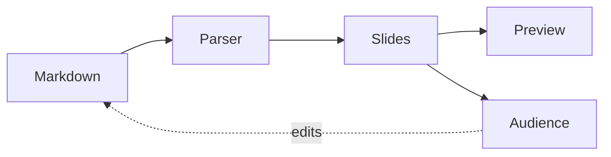

# Mermaid Flowchart TD

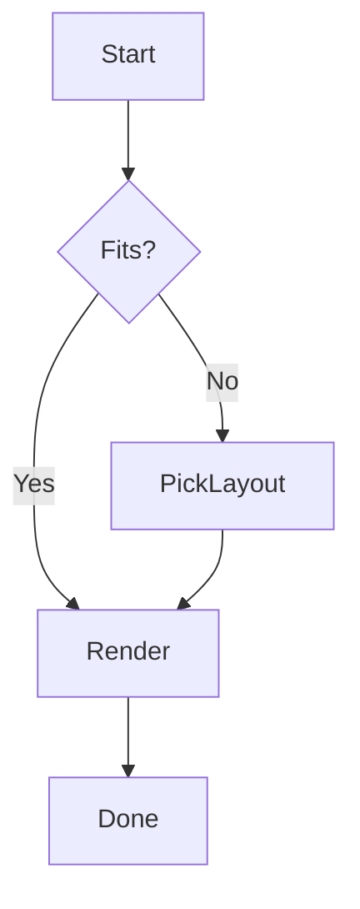

# Mermaid Sequence

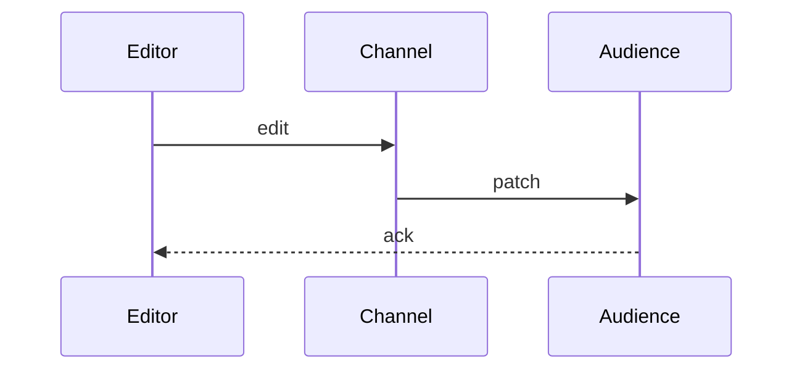

# Mermaid Class

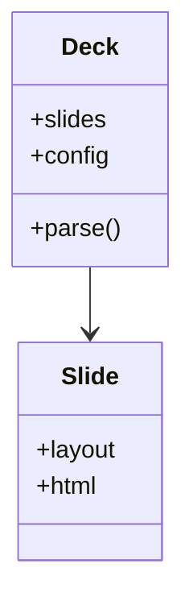

# Mermaid State

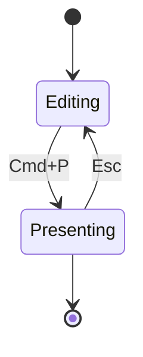

# Mermaid Pie

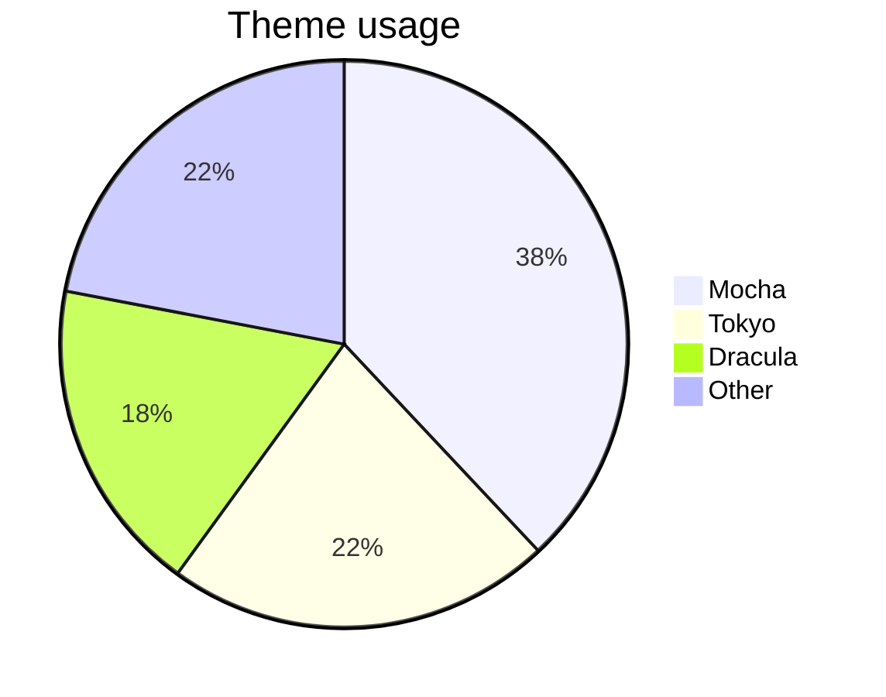

# Mermaid Gantt

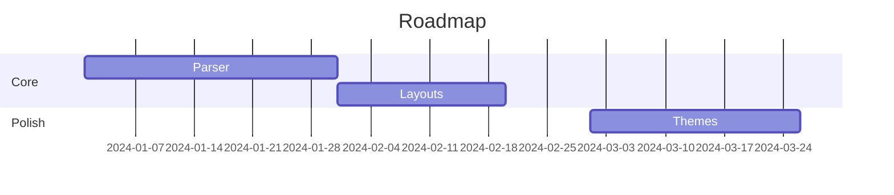

# Mermaid Large Graph

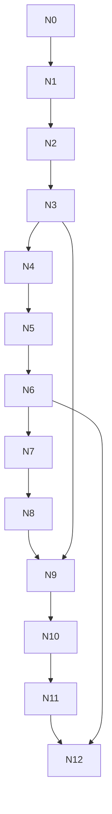

# Mermaid Wide Graph

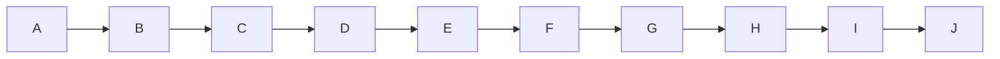

# Mermaid ER

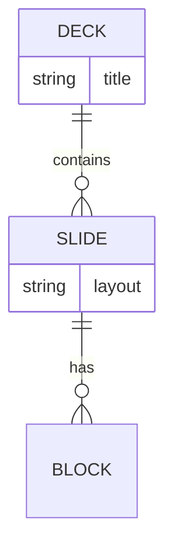

# Mermaid + Text

The pipeline:

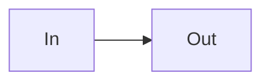

# Broken Mermaid (graceful)

```mermaid
graph LR
  A -->
  this is not valid mermaid syntax @@@
```

# Bar Chart

```chart
type: bar
title: Quarterly revenue
data:
  Q1: 12
  Q2: 19
  Q3: 8
  Q4: 27
```

# Line Chart Multi-series

```chart
type: line
title: Growth
labels: [Jan, Feb, Mar, Apr, May, Jun]
series:
  Revenue: [10, 15, 14, 22, 30, 38]
  Profit: [2, 4, 5, 9, 14, 19]
```

# Pie Chart

```chart
type: pie
title: Share
data:
  A: 40
  B: 30
  C: 20
  D: 10
```

# Donut Chart

```chart
type: donut
title: Bundle
data:
  App: 320
  Grammars: 410
  Mermaid: 180
  KaTeX: 90
```

# Bar Many Categories

```chart
type: bar
title: Monthly
data:
  M1: 10
  M2: 44
  M3: 46
  M4: 16
  M5: 40
  M6: 48
  M7: 21
  M8: 36
  M9: 50
  M10: 26
  M11: 32
  M12: 50
```

# Line Many Points

```chart
type: line
title: Signal
labels: [t0, t1, t2, t3, t4, t5, t6, t7, t8, t9, t10, t11, t12, t13, t14, t15, t16, t17, t18, t19]
series:
  Value: [50, 69, 84, 90, 86, 74, 56, 36, 20, 11, 12, 22, 39, 59, 76, 88, 90, 82, 66, 47]
```

# Chart + Text

Revenue trend below:

```chart
type: bar
data:
  A: 5
  B: 12
  C: 7
```

# Pie Many Slices

```chart
type: pie
title: Languages
data:
  TS: 5
  JS: 8
  CSS: 11
  HTML: 14
  Rust: 17
  Go: 20
  Py: 23
  SQL: 26
```

# Chart Long Labels

```chart
type: bar
title: Departments
data:
  Engineering and Platform: 45
  Product and Design Systems: 30
  Customer Success Operations: 25
```

# Chart Single Value

```chart
type: bar
data:
  Only: 42
```

# Chart Big Numbers

```chart
type: bar
title: Users
data:
  2021: 1200000
  2022: 3400000
  2023: 8900000
```

# Broken Chart (graceful)

```chart
type: nonsense
this: is not: valid: yaml: at all: [
```

# Tip Callout

:::tip
Prefer `#` over `##` for slide titles.
:::

# All Callout Types

:::tip
A tip.
:::

:::warning
A warning.
:::

:::info
Some info.
:::

:::danger
Danger ahead.
:::

# Callout With Title

:::warning Heads up
Don't put metadata comments inside fenced code blocks.
:::

# Long Callout

:::note
The quick brown fox jumps over the lazy dog while the parser tokenizes each heading, list item, and fenced block into a slide the renderer can lay out without reflowing the fixed canvas. The quick brown fox jumps over the lazy dog while the parser tokenizes each heading, list item, and fenced block into a slide the renderer can lay.
:::

# Stacked Callouts (6)

:::tip
Tip
:::

:::info
Info
:::

:::note
Note
:::

:::warning
Warning
:::

:::danger
Danger
:::

:::success
Success
:::

# Stats 4

:::stats
- **17** Themes
- **10** Layouts
- **<500KB** Bundle
- **0** Backends
:::

# Stats 8

:::stats
- **1** One
- **2** Two
- **3** Three
- **4** Four
- **5** Five
- **6** Six
- **7** Seven
- **8** Eight
:::

# Stats Long Labels

:::stats
- **99.99%** Uptime across all monitored regions worldwide
- **12ms** Median render latency for a full deck reflow
- **3.2M** Monthly active presenters and counting
:::

# Compare

:::compare
## Before
- single CRUD table
- no audit trail
- one writer wins

## After
- append-only events
- complete audit trail
- history is truth
:::

# Compare Long

:::compare
## Before
- old point 1
- old point 2
- old point 3
- old point 4
- old point 5
- old point 6
- old point 7
- old point 8

## After
- new point 1
- new point 2
- new point 3
- new point 4
- new point 5
- new point 6
- new point 7
- new point 8
:::

# Timeline

:::timeline
- **2020** First sketch on a napkin
- **2022** Internal demo
- **2024** Open-sourced on GitHub
- **2025** Hits 1k stars
:::

# Timeline Long

:::timeline
- **2020** The quick brown fox jumps over the lazy dog while the parser tokenizes each.
- **2021** The quick brown fox jumps over the lazy dog while the parser tokenizes each.
- **2022** The quick brown fox jumps over the lazy dog while the parser tokenizes each.
- **2023** The quick brown fox jumps over the lazy dog while the parser tokenizes each.
- **2024** The quick brown fox jumps over the lazy dog while the parser tokenizes each.
- **2025** The quick brown fox jumps over the lazy dog while the parser tokenizes each.
- **2026** The quick brown fox jumps over the lazy dog while the parser tokenizes each.
- **2027** The quick brown fox jumps over the lazy dog while the parser tokenizes each.
:::

# Short Quote

> Simplicity is the ultimate sophistication.

# Quote With Attribution

> Edit the markdown in this window. The audience window updates in real time.
>
> -- The whole pitch

# Long Quote

> The quick brown fox jumps over the lazy dog while the parser tokenizes each heading, list item, and fenced block into a slide the renderer can lay out without reflowing the fixed canvas. The quick brown fox jumps over the lazy dog while the parser tokenizes each heading, list item, and fenced block into a slide the renderer can lay.
>
> -- Someone Verbose

# Multi-paragraph Quote

> First paragraph of the quote sets the scene.
>
> Second paragraph delivers the punchline.
>
> -- Author Name

***

> A quote slide with no header, started via three asterisks.
>
> -- Anonymous

# Quote + Commentary

> The best interface is no interface.
>
> -- Golden Krishna

The quick brown fox jumps over the lazy dog while the parser tokenizes each heading, list item, and fenced block.

# Nested Blockquote

> Outer quote begins here.
>
> > Nested inner quote.
>
> Back to outer.

# Quote Heavy Punctuation

> "Why?" she asked. "Because," he said, "it's — well — complicated; isn't it?"

# Very Long Quote Overflow Test

> The quick brown fox jumps over the lazy dog while the parser tokenizes each heading, list item, and fenced block into a slide the renderer can lay out without reflowing the fixed canvas. The quick brown fox jumps over the lazy dog while the parser tokenizes each heading, list item, and fenced block into a slide the renderer can lay out without reflowing the fixed canvas. The quick brown fox jumps over the lazy dog while the parser tokenizes each heading, list item, and fenced block into a slide the renderer can lay out without reflowing the fixed canvas. The quick brown fox jumps over the lazy dog while the parser tokenizes each heading, list item, and fenced block into a slide the renderer can lay out without reflowing the fixed canvas. The quick brown fox jumps over the lazy dog while the parser tokenizes each heading, list item, and.
>
> -- The Overflow Tester

# Quote CJK

> 千里之行，始于足下。
>
> -- 老子

# Full Image


# Full Image With Caption

<!-- layout: full-image -->


# Image Left

<!-- layout: image-left -->


## Image on the left

The quick brown fox jumps over the lazy dog while the parser tokenizes each heading, list item, and fenced block into a slide the renderer can lay out without reflowing.

# Image Right

<!-- layout: image-right -->

## Image on the right

The quick brown fox jumps over the lazy dog while the parser tokenizes each heading, list item, and fenced block into a slide the renderer can lay out without reflowing.


# Image + Long Body

<!-- layout: image-left -->


## Details

The quick brown fox jumps over the lazy dog while the parser tokenizes each heading, list item, and fenced block into a slide the renderer can lay out without reflowing the fixed canvas. The quick brown fox jumps over the lazy dog while the parser tokenizes each heading, list item, and fenced block into a slide the renderer can lay out without reflowing the fixed canvas. The quick brown fox jumps over the lazy dog while the parser tokenizes each.

# Tall Image


# Wide Image


# Small Image


The quick brown fox jumps over the lazy dog while the parser tokenizes each heading,.

# Broken Remote Image (graceful)


A broken image URL must not break the layout.

# Two Images

 

# Image + Code


```js
const x = renderImage();
```

# Image Then List


- First takeaway
- Second takeaway
- Third takeaway

# Two Column Balanced

<!-- layout: two-column -->

## Left

The quick brown fox jumps over the lazy dog while the parser tokenizes each heading, list item, and fenced block.

---

## Right

The quick brown fox jumps over the lazy dog while the parser tokenizes each heading, list item, and fenced block.

# Two Column Lists

<!-- layout: two-column -->

## Pros

- fast
- simple
- offline

---

## Cons

- new
- niche
- opinionated

# Two Column Unbalanced

<!-- layout: two-column -->

## Tiny

One line.

---

## Huge

The quick brown fox jumps over the lazy dog while the parser tokenizes each heading, list item, and fenced block into a slide the renderer can lay out without reflowing the fixed canvas. The quick brown fox jumps over the lazy dog while the parser tokenizes each heading, list item, and fenced block into a slide the renderer can lay out without reflowing the fixed canvas. The quick brown fox jumps over the lazy dog while the parser tokenizes each.

# Two Column Code Left

<!-- layout: two-column -->

## Code

```js
const a = 1;
const b = 2;
```

---

## Explanation

The quick brown fox jumps over the lazy dog while the parser tokenizes each heading, list item, and fenced block into a slide the renderer.

# Two Column Both Long

<!-- layout: two-column -->

## Left Side

The quick brown fox jumps over the lazy dog while the parser tokenizes each heading, list item, and fenced block into a slide the renderer can lay out without reflowing the fixed canvas. The quick brown fox jumps over the lazy dog while the parser tokenizes each heading, list item,.

---

## Right Side

The quick brown fox jumps over the lazy dog while the parser tokenizes each heading, list item, and fenced block into a slide the renderer can lay out without reflowing the fixed canvas. The quick brown fox jumps over the lazy dog while the parser tokenizes each heading, list item,.

# Two Column Auto (no directive)

## Left auto

The quick brown fox jumps over the lazy dog while the parser tokenizes each heading,.

---

## Right auto

The quick brown fox jumps over the lazy dog while the parser tokenizes each heading,.

# Two Column With Math

<!-- layout: two-column -->

## Formula

$$E = mc^2$$

---

## Meaning

Mass and energy are equivalent.

# Two Column Nested Lists

<!-- layout: two-column -->

## Frontend

- React
  - hooks
  - context
- Vite

---

## Backend

- None
  - local-first
  - IndexedDB

# Two Column Long Lists

<!-- layout: two-column -->

## Column A

- a-item 1
- a-item 2
- a-item 3
- a-item 4
- a-item 5
- a-item 6
- a-item 7
- a-item 8
- a-item 9
- a-item 10
- a-item 11
- a-item 12

---

## Column B

- b-item 1
- b-item 2
- b-item 3
- b-item 4
- b-item 5
- b-item 6
- b-item 7
- b-item 8
- b-item 9
- b-item 10
- b-item 11
- b-item 12

# Two Column Images

<!-- layout: two-column -->

## Before


---

## After


# Two Column Table

<!-- layout: two-column -->

## Data

| X | Y |
|---|---|
| 1 | 2 |
| 3 | 4 |

---

## Notes

The quick brown fox jumps over the lazy dog while the parser tokenizes each heading, list item, and fenced block.

# Two Column Callouts

<!-- layout: two-column -->

## Do

:::success
Commit often
:::

---

## Don't

:::danger
Force push main
:::

# Inline Icons

:icon[zap]: Fast · :icon[shield]: Secure · :icon[github]: Open source · :icon[heart]: Loved

# Fragments

- Always visible
- + Revealed on step one
- + Revealed on step two
- + Revealed on step three

# Custom Background

<!-- bg: #1a1a2e; color: #e0e0ff -->

This slide overrides its background and text colour via metadata.

The quick brown fox jumps over the lazy dog while the parser tokenizes each heading,.

# Everything At Once

## Kitchen sink

The quick brown fox jumps over the lazy dog while the parser.

- bullet with $x^2$
- bullet with `code`

:::tip
A callout too.
:::

# Heading Hierarchy

## H2 heading

### H3 heading

#### H4 heading

The quick brown fox jumps over the lazy dog while the parser tokenizes each heading,.

# Horizontal Rules As Content

Above the rule.

---

Below the rule.

# RTL Text

Arabic: مرحبا بالعالم هذا نص تجريبي للتأكد من أن النص من اليمين إلى اليسار يظهر بشكل صحيح.

Hebrew: שלום עולם זהו טקסט לבדיקה.

# CJK Dense

日本語のテキスト。これはスライドが日本語の文字を正しくレンダリングできることを確認するためのテストです。中文文本用于测试。한국어 텍스트도 포함됩니다.

# Special Characters

```
\ / | < > & " ' ` ~ ! @ # $ % ^ * ( ) _ + = { } [ ] : ; , . ?
```

And inline: <not a tag> & ``backtick`` handling.

# The End

<!-- layout: end -->

## 160 slides, all rendered